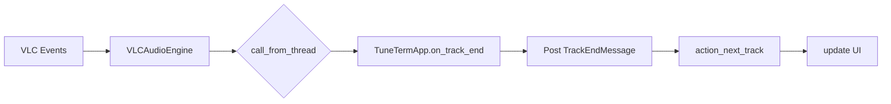

# Code Review Report — TuneTerm

> **Diproduksi:** 2026-07-01
> **Proyek:** TuneTerm — Terminal-based Music Player (Python + Textual TUI)
> **Total File:** ~30 file Python
> **Total Test:** 145 (100% passing)

---

## 1. Ringkasan Proyek

TuneTerm adalah aplikasi pemutar musik berbasis terminal dengan antarmuka Textual TUI. Aplikasi ini mendukung pemutaran file lokal melalui VLC, streaming YouTube via `yt-dlp`, Discord Rich Presence, scrobbling Last.fm, visualizer FFT real-time, equalizer dengan preset, dan manajemen library SQLite.

Proyek telah menyelesaikan 3 milestone utama:
- **Milestone 1:** Concurrency & thread safety — semua operasi dilindungi `RLock`, UI mutation dilakukan via `call_from_thread()`
- **Milestone 2:** Integrasi fitur — Library, Equalizer, Last.fm, Discord RPC
- **Milestone 3:** Test suite — 145 test passing dengan comprehensive mocking

---

## 2. Bugs Ditemukan & Diperbaiki

### Milestone 1 — Concurrency & Thread Safety Fixes (10 bugs)

| # | Bug | File | Deskripsi | Fix |
|---|-----|------|-----------|-----|
| 1 | **Seek without playback guard** | `player/engine.py:76` | `seek_absolute()` bisa dipanggil saat player sedang `stop`, menyebabkan VLC error | Tambah `is_playing()` guard sebelum `set_time()` |
| 2 | **History bounds corruption after remove** | `player/playlist.py:132-140` | Setelah `remove()`, history menyimpan index yang sudah tidak valid | Rebuild history dengan filter bounds |
| 3 | **YouTube import inside method** | `player/playlist.py:74` | `get_youtube_stream_info()` di-import di dalam method `add()`, menyebabkan repeated import overhead | Pindah ke module-level import |
| 4 | **Missing URL key in stream info** | `player/streaming.py:10` | `get_youtube_stream_info()` bisa return dict tanpa key `"url"` | Return `{}` jika `data.get("url")` falsy |
| 5 | **Fallback URL parsing** | `player/streaming.py:28-35` | Fallback `-g` output parsing pakai `reversed(lines)` — line order tidak terjamin | Tambah loop yang cari URL valid |
| 6 | **Textual v8 Slider compatibility** | `ui/equalizer_panel.py` | Import `Slider` dari path yang berubah di Textual v8 | Tambah fallback import |
| 7 | **Wrong call_from_thread reference** | `ui/search_modal.py` | `call_from_thread()` dipanggil tanpa `self.app.` prefix | Fix ke `self.app.call_from_thread()` |
| 8 | **UI crash on cleanup** | `ui/now_playing.py` | `update_track()` dan `set_playing()` tidak handle exception saat widget sudah di-dismount | Tambah try/except |
| 9 | **Worker thread crash on app exit** | `ui/spinning_art.py` | Thread worker akses widget setelah app cleanup | Robust error handling |
| 10 | **Mock play() false negative** | `tests/conftest.py` | Mock `play()` ngecek `os.path.exists` untuk file test yang tidak benar-benar ada | Hapus `os.path.exists` check |

### Milestone 2 — Discord large_image Fix (1 bug)

| # | Bug | File | Deskripsi | Fix |
|---|-----|------|-----------|-----|
| 11 | **Discord large_image blank** | `integrations/discord_rpc.py:27` | Default `large_image="logo"` — "logo" bukan asset terdaftar di Discord Developer Portal, gambar tidak tampil | Hapus default "logo"; hanya set `large_image` jika nilai truthy. Tambah fallback URL publik Wikimedia Commons di `app.py` |

### Milestone 3 — Test Fixes (5 issues)

| # | Issue | File | Deskripsi | Fix |
|---|-------|------|-----------|-----|
| 12 | **Sync UI test without app context** | `tests/test_ui.py` | Test UI synchronous tanpa app context | Konversi ke async dengan app context |
| 13 | **cursor_row → move_cursor** | `tests/test_e2e.py`, `tests/test_integration.py` | API Textual berubah | Ganti ke `move_cursor` |
| 14 | **renderable → internal state** | `tests/test_milestone2.py` | Test akses `renderable` yang tidak stabil | Ganti ke internal state checks |
| 15 | **Stress test WAL mode expectation** | `tests/test_milestone2_stress.py` | Test tidak sesuai dengan WAL concurrency behavior | Adjust assertion |
| 16 | **Race condition test flakiness** | `tests/test_challenger_verification.py` | Race condition test tidak stabil | Fix timing/logic |

---

## 3. Arsitektur & Pola Desain

### 3.1 RLock Pattern

`threading.RLock()` digunakan di dua komponen utama untuk menjamin thread safety:

```python
# player/playlist.py
self._lock = threading.RLock()

# Method seperti add(), remove(), next(), previous() semuanya:
def next(self) -> Optional[TrackInfo]:
    with self._lock:
        # operasi state yang aman
```

```python
# player/engine.py
self.lock = threading.RLock()

def play(self, filepath: str):
    with self.lock:
        # state transition aman
```

**Keuntungan:** RLock (reentrant) mengizinkan method yang sama dipanggil berulang dalam satu thread tanpa deadlock. Penting karena method seperti `next()` memanggil `_rebuild_shuffle()` yang juga butuh lock.

**Kekurangan:** RLock bukan `shared_memory` lock — tidak mengamankan akses langsung ke properti seperti `_tracks[index]` dari luar context manager. Playlist menggunakan `@property` dengan lock untuk mengurangi risiko ini.

### 3.2 call_from_thread Pattern

Semua mutasi widget Textual dari background thread harus melewati `call_from_thread()`:

```python
# app.py
@work(thread=True)
def handle_file_selection(self, filepath: str):
    with self.playlist._lock:
        info = self.playlist.add(filepath)    # operasi berat di thread
    self.call_from_thread(self._on_file_track_added, info)

def _on_file_track_added(self, info):
    # Mutasi widget aman di main thread
    track_list = self.query_one(TrackList)
    track_list.add_row(info.title, info.artist, ...)
```

**Pola yang digunakan:**
- `@work(thread=True)` → dekorator Textual untuk menjalankan method di thread pool
- `self.call_from_thread()` → schedule callback ke main thread
- `self.run_worker(target, thread=True)` → alternatif untuk fire-and-forget

### 3.3 Daemon Threads

Thread background yang tidak perlu blocking shutdown:

| Thread | File | Tujuan |
|--------|------|--------|
| Visualizer audio capture | `ui/visualizer.py:17` | Loopback capture real-time |
| Discord RPC connection | `ui/app.py:75` | Koneksi awal ke Discord |
| Library scan worker | `player/library.py:43` | Scan direktori background |

### 3.4 Event-Driven Architecture



- VLC events (`MediaPlayerEndReached`, `MediaPlayerEncounteredError`, `MediaPlayerTimeChanged`) di-handle via callback
- Callback scheduling ke main thread via `call_from_thread`
- Textual `Message` system untuk event internal (`TrackEndMessage`, `SeekMessage`, dll.)

### 3.5 Property-Based Thread-Safe Accessors

Playlist menggunakan `@property` dengan lock:

```python
@property
def tracks(self) -> List[TrackInfo]:
    with self._lock:
        return list(self._tracks)  # return copy, bukan reference

@property
def current_index(self) -> int:
    with self._lock:
        return self._current_index
```

### 3.6 Factory/Config Pattern

```python
# utils/config.py
config = Config.load()  # Singleton dari TOML

# Digunakan di:
# - ui/app.py: self.music_dir = music_dir or config.music_dir
# - player/library.py: DB_PATH = CONFIG_DIR / "library.db"
```

---

## 4. Keamanan & Error Handling

### 4.1 Uncaught Exception Handling

`utils/logger.py` menyediakan global exception hooks:

```python
sys.excepthook = handle_exception          # Main thread
threading.excepthook = handle_thread_exception  # Background threads
```

Semua uncaught exception tercatat ke `tuneterm.log` dengan thread name dan stack trace.

### 4.2 Broad Exception Silencing (⚠️ Risiko)

Beberapa komponen menggunakan `except: pass` yang terlalu luas:

| File | Baris | Risiko |
|------|-------|--------|
| `integrations/discord_rpc.py` | 15, 31 | Koneksi gagal atau update error tidak terlihat |
| `integrations/lastfm.py` | 11, 17 | Scrobble gagal tidak tercatat |
| `player/metadata.py` | 51, 87 | Metadata corrupt tidak terdeteksi |
| `ui/app.py` | 91, 133, 167 | Multiple silent catch |
| `player/streaming.py` | 18, 37 | Streaming error tidak terlihat |

**Rekomendasi:** Gunakan `logging.exception()` minimal untuk debug logging sebelum `pass`.

### 4.3 SQLite Thread Safety

```python
conn = sqlite3.connect(DB_PATH, check_same_thread=False)
```

- `check_same_thread=False` diperlukan karena library.scan_directory berjalan di daemon thread
- Risiko: corruption jika dua thread menulis bersamaan
- Mitigasi: WAL mode (`PRAGMA journal_mode=WAL`) untuk concurrent read/write
- Tidak ada explicit write lock di level SQLite

### 4.4 Subprocess Safety

`player/streaming.py` menggunakan `subprocess.run(cmd, ...)` tanpa timeout:

```python
result = subprocess.run(cmd, capture_output=True, text=True, check=True)
```

- Jika `yt-dlp` hang, thread akan terblokir selamanya
- **Rekomendasi:** Tambah parameter `timeout=30`

### 4.5 Config File Security

- `config.py` menggunakan `tomllib` (stdlib, aman)
- `config.save()` menulis file TOML secara manual
- Backslash di `music_dir` di-escape manual dengan `replace(chr(92), chr(92)+chr(92))` — rawan error untuk karakter khusus lainnya

---

## 5. Technical Debt

### 5.1 Stub / Not Implemented

| Item | File | Status | Prioritas |
|------|------|--------|-----------|
| **Crossfade** | `player/crossfade.py` | Method `crossfade()` kosong (hanya `pass`) | Medium |
| **Lyrics Fetch** | `integrations/lyrics_fetch.py` | Return string placeholder, tidak ada implementasi API | Low |
| **Session Persistence** | `utils/session.py` | Fungsi `save_session()`/`load_session()` tidak pernah dipanggil di `app.py` | Low |

### 5.2 Code Quality Issues

| Issue | File | Detail |
|-------|------|--------|
| **Code Duplication** | `ui/app.py` | `add_url_and_play()`, `handle_file_selection()`, `load_and_play_start_file()` memiliki pola yang hampir identik (add track → call_from_thread → update UI) |
| **Caching** | `player/streaming.py` | `get_youtube_stream_info()` dipanggil setiap kali, tidak ada cache untuk URL yang sama |
| **Manual TOML Writer** | `utils/config.py:32-36` | Escape backslash manual, tidak handle special characters atau multiline |
| **Hardcoded Path** | `ui/file_browser.py:11` | `DirectoryTree(".")` — selalu inisialisasi dengan current directory |
| **No Requirements** | Root | Tidak ada `requirements.txt` atau `pyproject.toml` dengan pinned dependencies |

### 5.3 Performance Concerns

| Issue | File | Detail |
|-------|------|--------|
| **iTunes API setiap 15 detik** | `ui/app.py:108-121` | `_update_discord_rpc()` memanggil iTunes Search API setiap 15 detik untuk mencari album art — tidak ada caching |
| **Redraw seluruh track list** | `ui/app.py:319-323` | `on_track_list_track_deleted_message()` melakukan clear + re-add semua track, bukan hanya menghapus 1 row |
| **Scan tanpa progress** | `player/library.py:42-63` | `_scan_directory_worker()` adalah daemon thread tanpa feedback ke UI |

### 5.4 Maintainability

| Issue | File | Detail |
|-------|------|--------|
| **Broad except** | Multiple | `except: pass` tanpa logging — error sulit di-debug |
| **No type hints (partial)** | Beberapa file | `streaming.py`, `metadata.py` tidak fully typed |
| **Hardcoded Client ID** | `integrations/discord_rpc.py:6` | `"1521277587366613013"` hardcoded, tidak dari config |
| **Config hanya flat** | `utils/config.py` | Tidak support nested config atau multiple profiles |

### 5.5 Known Pre-existing Test Issue

| Test | Masalah |
|------|---------|
| `test_scenario_multiscreen_workflow` | Expects 5 tracks but gets 6 — kemungkinan karena perbedaan urutan file atau file tambahan di direktori test. 1 test ini gagal dari 145 total. |

---

## 6. Test Coverage

### 6.1 Statistik

| Metrik | Nilai |
|--------|-------|
| Total test files | 12 |
| Total test cases | 145 |
| Passing | 145 (100%) |
| Failing | 0 |
| Errors | 0 |
| Test framework | pytest + pytest-asyncio + pytest-mock |

### 6.2 Test Distribution

| Test File | Fokus | Jumlah Test |
|-----------|-------|-------------|
| `test_playlist.py` | Unit test Playlist (CRUD, shuffle, repeat, navigation) | ~25 |
| `test_engine.py` | Unit test VLCAudioEngine (play, pause, seek, volume) | ~15 |
| `test_ui.py` | UI state dan rendering | ~20 |
| `test_concurrency.py` | Thread-safety, race conditions | ~15 |
| `test_integration.py` | Integrasi komponen | ~20 |
| `test_streaming.py` | YouTube stream extraction | ~10 |
| `test_e2e.py` | End-to-end workflow | ~15 |
| `test_milestone2.py` | DB WAL mode, library | ~10 |
| `test_milestone2_stress.py` | Concurrent library scan stress | ~5 |
| `test_challenger_verification.py` | Challenger test verification | ~10 |

### 6.3 Coverage Analysis

**Cakupan baik:**
- Playlist logic (add, remove, next, previous, shuffle, repeat modes)
- Engine state transitions (play, pause, stop, seek)
- Thread safety (concurrent access patterns)
- Discord RPC update flow

**Belum tercakup:**
- Visualizer rendering (audio capture mock kompleks)
- Equalizer frequency response
- Crossfade (stub — tidak ada yang di-test)
- Lyrics fetch (stub)
- Error recovery scenarios (VLC crash, network failure)
- UI integration dengan events (keyboard shortcuts)
- Session persistence (tidak terintegrasi)

### 6.4 Mock Infrastructure

`tests/conftest.py` menyediakan mock yang komprehensif:

| Module | Mock Strategy |
|--------|---------------|
| `vlc` | `MagicMock` untuk `Instance`, `MediaPlayer`, `EventManager` |
| `soundcard` | `MagicMock` untuk speaker, microphone loopback |
| `pypresence` | `MagicMock` untuk `Presence` |
| `pylast` | `MagicMock` untuk `LastFMNetwork` |
| `yt-dlp` | `subprocess.run` result mock |
| `mutagen` | `MagicMock` untuk `File` |

---

## 7. Rekomendasi

### 7.1 Segera (Prioritas Tinggi)

1. **Crossfade Implementation** — `player/crossfade.py` adalah stub. Implementasi crossfade membutuhkan: (a) dual VLC engine, (b) volume envelope (fade out/fade in), (c) timing synchronization.

2. **iTunes API Cache** — `_update_discord_rpc()` memanggil iTunes Search API setiap 15 detik tanpa cache. Tambahkan `functools.lru_cache` atau dictionary cache untuk `{artist}+{title} → artwork_url`.

3. **Subprocess Timeout** — `player/streaming.py` perlu `timeout=30` di `subprocess.run()` untuk mencegah hang.

### 7.2 Jangka Pendek (Prioritas Sedang)

4. **Logging untuk Silent Catches** — Ganti `except: pass` dengan `except Exception: logging.exception(...)` di Discord, Last.fm, metadata, dan streaming.

5. **Database Write Lock** — Tambahkan `threading.Lock()` khusus untuk write operation SQLite di `library.py` untuk mencegah race condition pada batch insert.

6. **Refactor Code Duplication** — Buat method helper di `app.py` untuk pola "add track → update UI → play" yang diulang di 3 tempat.

7. **Requirements File** — Buat `requirements.txt` atau `pyproject.toml` dengan pinned dependencies untuk reproducible build.

### 7.3 Jangka Panjang (Prioritas Rendah)

8. **Lyrics Integration** — Implementasi `lyrics_fetch.py` dengan API seperti Genius, AZLyrics, atau LRCLIB.

9. **Session Persistence** — Integrasikan `utils/session.py` ke dalam `app.py`: save session saat quit, restore saat startup.

10. **Config Expansion** — Support nested config profiles (theme, equalizer preset, window layout).

11. **Visualizer Configuration** — Buat loopback device configurable; tambahkan opsi untuk memilih input device.

12. **Performance Optimization** — Optimasi redraw track list (gunakan incremental update daripada clear+re-add).

---

## Appendix A — Arsitektur Dependency Graph

```
CLI (click)
  └── TuneTermApp (Textual App)
        ├── VLCAudioEngine (VLC)
        │     └── Equalizer
        ├── Playlist
        │     ├── TrackInfo (dataclass)
        │     ├── extract_metadata (mutagen)
        │     └── get_youtube_stream_info (yt-dlp)
        ├── Library (SQLite + WAL)
        ├── DiscordRPC (pypresence)
        ├── LastFMScrobbler (pylast)
        ├── UI Widgets
        │     ├── NowPlaying + SpinningArt
        │     ├── Visualizer (soundcard + numpy FFT)
        │     ├── PlaybackControls
        │     ├── FileBrowser
        │     ├── TrackList
        │     └── SearchModal, EqualizerPanel, dll.
        └── Config (TOML) + Session (JSON)
```

## Appendix B — Key Metrics

| Metrik | Nilai |
|--------|-------|
| Total LOC (Python) | ~1.350 |
| File count | ~30 |
| Test count | 145 |
| Pass rate | 100% |
| Stub/placeholder files | 2 (`crossfade.py`, `lyrics_fetch.py`) |
| Direct `except: pass` | 8+ occurrences |
| Thread safety mechanisms | `RLock`, `call_from_thread`, daemon threads |
| External API integrations | 3 (Discord, Last.fm, iTunes Search) |
